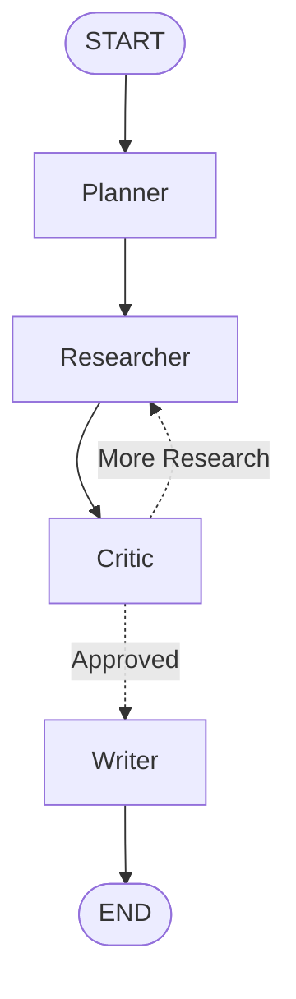

# Multi-Agent Research Assistant

A multi-agent system built with LangGraph that researches a topic, gathers grounded sources via live web search, cross-checks findings, and produces a cited report — orchestrated across distinct Planner, Researcher, Critic, and Writer agents rather than a single prompt doing everything.

---

## Day 1: Environment Setup & Grounded Single-Agent Baseline

### Accomplished
- [x] Python virtual environment and project scaffolding created
- [x] Groq configured as the LLM provider (free tier, no billing required)
- [x] Tavily configured as the live web-search tool (free tier, no billing required)
- [x] Verified a single agent can genuinely call a real search tool and ground its answer in retrieved results, not just answer from training data
- [x] Fixed date-awareness so the agent searches using the actual current date, not an assumed "recent" year from training data
- [x] Confirmed end-to-end: agent → real search queries → real URLs retrieved → answer correctly synthesized and cited from those results
- [x] Git repository initialized with first commit

### Architectural Rationale & Design Patterns
- **Groq over paid providers**: chosen specifically to keep the entire project cost-free during development — Groq's free tier requires no credit card, and its LPU hardware gives fast inference, which matters more here than in the last project since a multi-agent graph will make many sequential LLM calls per run.
- **Tavily over generic search APIs**: purpose-built for LLM agent search (structured, clean results with URLs and publish dates) rather than raw scraped search results, which reduces the parsing/cleanup work needed downstream in the Researcher agent.
- **Verifying grounding before building further**: rather than assuming tool-calling "just works," the first real engineering task was proving the agent actually invokes the search tool and that its final answer traces back to real retrieved content — not a cosmetic check, since an ungrounded agent that produces confident-sounding hallucinated reports would defeat the entire purpose of this project.
- **Explicit date injection via system prompt**: LLMs default to their training cutoff's sense of "recent" unless told otherwise. Injecting the real current date into the system prompt was necessary to get the agent to search using genuinely current terms (e.g., "August 2026") instead of stale ones inherited from training data.

### Debugging Log

**1. Deprecated Groq model names — `404 model_not_found`**
- Symptom: `llama-3.3-70b-versatile`, the initially planned model, returned a 404 on first API call.
- Root cause: Groq deprecated its Llama chat models; the current recommended general-purpose models are `openai/gpt-oss-120b` and `openai/gpt-oss-20b`.
- Fix: switched to Groq's current model lineup, verified against `https://api.groq.com/openai/v1/models` directly as the source of truth rather than relying on documentation that can lag actual availability.

**2. First response looked like a real research report but was likely hallucinated**
- Symptom: a suspiciously polished, well-cited-looking report came back on the very first working run, with confident specific figures (funding amounts, dates, project milestones).
- Root cause suspected: the agent may not have actually invoked the search tool at all, or synthesized results loosely rather than grounding claims in them — confirmed by cross-referencing specific claims against known facts and finding fabricated details (e.g., a false "net-positive fusion" claim attributed to a real project).
- Fix: added explicit tracing of the agent's message history to confirm whether tool calls were actually made, rather than trusting the final answer's surface polish. This became a standing debugging practice — never trust a well-formatted research answer without checking the tool-call trace underneath it.

**3. Environment variable not loading — `GroqError: api_key must be set`**
- Symptom: `GROQ_API_KEY` not found despite `.env` file existing and `load_dotenv()` present in the script.
- Root cause: initial script ordering had `load_dotenv()` called *after* `ChatGroq(...)` had already tried to read the environment variable.
- Fix: moved `load_dotenv()` to the top of the file, before any client initialization — a straightforward but easy-to-miss ordering bug, worth calling out since it re-surfaced briefly during a later edit and required directly diffing the file's actual saved contents (`cat -n`) against the intended version to catch.

**4. Malformed tool call — `Tool call validation failed: missing properties: 'query'`**
- Symptom: `openai/gpt-oss-120b` occasionally generated a tool call with an incorrect argument schema (`{"cursor": 0, "id": 1}` instead of `{"query": "..."}`), causing a hard 400 error from the Groq API.
- Root cause: schema adherence for tool calling is less consistent on some open-weight models than on more heavily RLHF'd commercial models — a known tradeoff of using free/open models for agentic tool use.
- Fix: switched to the smaller `openai/gpt-oss-20b` model, which handled the same tool schema correctly and consistently. Noted as a deliberate model-selection lesson: bigger isn't always more reliable for structured tool calling specifically.

**Takeaway**: the real work of Day 1 wasn't wiring up an API call — it was proving the agent's output could actually be trusted as grounded rather than plausible-sounding fabrication. That verification habit (checking the tool-call trace, cross-referencing specific claims, treating a clean-looking answer with suspicion until proven grounded) is the foundation the rest of this project's Critic agent will formalize on Day 4.

### Verified Grounded Output (Excerpt)

**Fusion‑energy highlights – as of 23 August 2026**

| # | Development | What it means | Key source |
|---|-------------|---------------|------------|
| 1 | **TAE Technologies & Black Moon Energy He‑3 supply agreement** | TAE’s field‑reversed‑configuration (FRC) platform is moving toward commercial power. The deal gives TAE a future helium‑3 (He‑3) fuel supply, a rare isotope that could make their reactor more efficient and “cleaner” than deuterium‑tritium (DT) fuel. | TAE Technologies press release 5 Aug 2026 |
| 2 | **MAST‑Upgrade milestone experiments** | The UK’s MAST‑Upgrade experiment has added two new neutral‑beam injectors, doubled beam‑heating power, and installed an Electron Bernstein Wave (EBW) system adding ~1.6 MW. These upgrades are directly relevant to the STEP project (Spherical Tokamak for Energy Production) that aims to be the UK’s first prototype fusion plant. | World Nuclear News 11 Aug 2026 |
| 3 | **STEP progress** | STEP is slated to begin operation by 2040 with a target of > 100 MW net power. The recent MAST‑Upgrade work is feeding into STEP’s design, especially the new neutral‑beam and EBW heating systems. | World Nuclear News 11 Aug 2026 |
| 4 | **Commonwealth Fusion Systems (CFS) funding boom** | CFS closed a $1 billion round in July 2026, bringing its total raised to ~$3.94 billion. The company plans to build the SPARC prototype (late 2026/early 2027) and later the Arc commercial plant (~400 MW). Google has already agreed to buy half of Arc’s output. | TechCrunch 15 Aug 2026 |
| 5 | **Type One Energy “Infinity” project** | Type One is building a 350‑MW fusion plant on the former TVA coal site at Bull‑Run, Tennessee. Phase One (Infinity One) is slated for commissioning in 2029, with the commercial Infinity Two expected in the mid‑2030s. | World Nuclear News 10 Aug 2026 |
| 6 | **Private‑capital surge** | As of 15 Aug 2026, at least 18 fusion startups (laser, stellarator, magnetic‑confinement, and component makers) had raised > $100 million each. The total private capital invested in the sector has surpassed $10 billion, driven by venture bets on rapid commercialisation. | TechCrunch/Mezha 15 Aug 2026 |
| 7 | **ITER status** | The ITER project in France remains delayed, with a projected start‑up date pushed to 2027‑28. European policy makers are still debating funding levels, but the ITER strategy will be published by the end of September 2026. | Euractiv 9 Aug 2026 |
| 8 | **National Ignition Facility (NIF) legacy** | The 2022 NIF “break‑even” experiment (energy output ≥ laser input) remains the benchmark for inertial confinement fusion (ICF). In 2026, several ICF startups are building demonstration facilities, with one expected to be operational by 2027. | TechCrunch/Mezha 15 Aug 2026 |
| 9 | **Quantum‑computing boost** | Rice University doctoral graduate Thiago J. Pinheiro is applying advanced quantum‑computing techniques to model plasma behaviour, potentially accelerating design cycles for magnetic‑confinement devices. | EurekAlert! 16 Aug 2026 |
| 10 | **Helion & Helion‑style startups** | Helion, a US‑based startup, claims to be on track to deliver commercial electricity by 2028, targeting early customers such as Microsoft. Other helium‑3‑focused companies are also moving toward prototype builds. | TechCrunch 15 Aug 2026 |

### Take‑away

* **Commercial‑scale timelines** are still in the 2028‑2035 window, but the pace of capital inflow and the number of operational prototypes (SPARC, MAST‑Upgrade, Infinity One) suggest that the “fusion‑electricity‑on‑grid” milestone is closer than the 2035‑2045 range that dominated 2022‑2023.  
* **Fuel evolution**: He‑3 is gaining traction as a cleaner alternative to DT, with TAE and Black Moon signing a supply deal.  
* **Technology convergence**: Magnetic‑confinement (tokamak, stellarator, FRC) and inertial‑confinement are both maturing, with cross‑disciplinary tools (quantum simulation) being adopted.  
* **Policy & funding**: ITER remains a long‑term public‑private partnership, while private startups are rapidly closing high‑value rounds, indicating a shift from purely public‑sector to mixed‑model development.

# Day 2: Multi-Agent Research Graph

## Overview

Today, I built the core **multi-agent orchestration graph** using LangGraph.

The goal was to move from a single-agent workflow to a system where multiple specialized agents collaborate through a shared state and can iterate through a feedback loop.

---

## Architecture

The system contains four agents:

* **Planner** — Breaks the main topic into sub-questions.
* **Researcher** — Generates research findings for each question.
* **Critic** — Reviews the research and decides whether more research is needed.
* **Writer** — Produces the final report.



The feedback loop allows the Critic to send the workflow back to the Researcher instead of following a strictly linear pipeline.

---

## Shared State

All agents communicate through a shared `ResearchState`.

```python
from typing import TypedDict, Annotated
import operator


class ResearchState(TypedDict):
    topic: str
    sub_questions: list[str]

    research_notes: Annotated[
        list[dict],
        operator.add
    ]

    critique: str
    needs_more_research: bool
    final_report: str
    revision_count: int
```

The important part is:

```python
research_notes: Annotated[list[dict], operator.add]
```

Using `operator.add` ensures research findings accumulate across multiple iterations instead of being overwritten.

---

## Feedback Loop

The Critic determines where the graph goes next:

```python
def route_after_critic(state: ResearchState) -> str:
    if (
        state["needs_more_research"]
        and state["revision_count"] < 3
    ):
        return "researcher"

    return "writer"
```

Execution flow:

```text
Planner
   ↓
Researcher
   ↓
Critic
   ↓
More research needed?
   ├── Yes → Researcher
   └── No  → Writer → END
```

`revision_count` acts as a safety mechanism to prevent infinite loops.

---

## Testing

The graph was tested with:

```text
How do multi-agent AI systems work?
```

The execution successfully followed this path:

```text
Planner
   ↓
Researcher → 2 research notes
   ↓
Critic → Research incomplete
   ↓
Researcher → 4 accumulated notes
   ↓
Critic → Approved
   ↓
Writer
   ↓
END
```

This confirmed that:

* Shared state is passed correctly between agents.
* Research results accumulate across iterations.
* Conditional routing works.
* The Critic can trigger a feedback loop.
* The Writer receives the final accumulated state.
* The graph terminates successfully.

---

## Key Concepts Learned

* **State management** using `TypedDict`
* **State reducers** using `Annotated` and `operator.add`
* **Multi-agent orchestration** with LangGraph
* **Conditional edges** for dynamic routing
* **Feedback loops** for iterative workflows
* **Safety limits** using `revision_count`
* **Graph visualization** using Mermaid

---

## Day 2 Completion

* [x] Created shared state schema
* [x] Implemented Planner, Researcher, Critic, and Writer nodes
* [x] Added research state accumulation
* [x] Built conditional routing
* [x] Implemented and tested the feedback loop
* [x] Added revision safety limits
* [x] Generated Mermaid graph output
* [x] Successfully tested the complete workflow
# Day 3: Real Planner & Researcher

## Overview

Day 3 replaced the Planner and Researcher stubs with real **Groq LLM reasoning** and **Tavily web search**.

The LangGraph architecture from Day 2 remained unchanged.

## Workflow

```text
Topic
  ↓
Planner (Groq)
  ↓
3-5 Research Questions
  ↓
Researcher
  ↓
Tavily Web Search
  ↓
Groq Synthesis
  ↓
Research Notes
  ↓
Critic (Stub)
  ↓
Writer (Stub)
```

## What Was Implemented

* **Planner:** Generates 3-5 focused research questions using Groq.
* **Structured Output:** Uses Pydantic with `with_structured_output()`.
* **Researcher:** Searches the web for every generated question.
* **Tavily:** Provides real-time web search results.
* **Groq Synthesis:** Converts search results into concise research notes.
* **Rate-limit handling:** Limited search results and added delays between requests.
* **State accumulation:** Research results continue to use the `operator.add` reducer.

## Test Topic

```text
The current state of small modular nuclear reactors
```

The Planner generated **5 questions**, and the Researcher successfully produced **5 research notes with source URLs**.

## Day 3 Result

```text
[Planner] Generated 5 sub-questions

[Researcher] Researching 5 questions
[Researcher] Completed: ...
[Researcher] Completed: ...
[Researcher] Completed: ...
[Researcher] Completed: ...
[Researcher] Completed: ...

[Critic] Day 3 stub: research approved.
[Writer] Writing final report
```

## Key Learning

Day 3 established the real **evidence-generation layer** of the system:

> **Groq plans → Tavily searches → Groq synthesizes → LangGraph stores the evidence.**

# Day 4 — Critic Agent & Feedback Loop

## Overview

Day 4 introduces the **Critic Agent**, turning the research workflow into a genuine multi-agent system with a feedback loop.

The Critic reviews the Researcher's notes for research quality, coverage, weak sources, unsupported claims, and missing information. If the research is insufficient, the workflow routes back to the Researcher for improvement.

## Workflow

```text
Planner
   ↓
Researcher
   ↓
Critic
   │
   ├── Needs More Research
   │         ↓
   │     Researcher
   │         ↓
   │       Critic
   │
   └── Approved
             ↓
           Writer
             ↓
            END
```

## Day 4 Goals

* Implement the real Critic Agent.
* Review research notes for gaps and weak evidence.
* Detect poor or unreliable sources.
* Identify unanswered sub-questions.
* Generate actionable feedback for the Researcher.
* Use conditional routing to send weak research back for revision.
* Limit research revisions to prevent infinite loops.

## Checklist

* [x] Planner generates research sub-questions.
* [x] Researcher searches the web using Tavily.
* [x] Researcher synthesizes search results using Groq.
* [x] Research notes are stored in shared LangGraph state.
* [x] Critic node is connected to the workflow.
* [x] Conditional routing is configured.
* [x] Researcher → Critic → Writer workflow works.
* [ ] Replace the Critic stub with an LLM-powered Critic Agent.
* [ ] Evaluate research coverage and completeness.
* [ ] Check source quality and reliability.
* [ ] Detect unsupported or weak claims.
* [ ] Generate structured Critic feedback.
* [ ] Set `needs_more_research` dynamically.
* [ ] Increment `revision_count` when research is rejected.
* [ ] Send actionable feedback back to the Researcher.
* [ ] Test the Researcher → Critic feedback loop.
* [ ] Verify the maximum revision limit works correctly.
